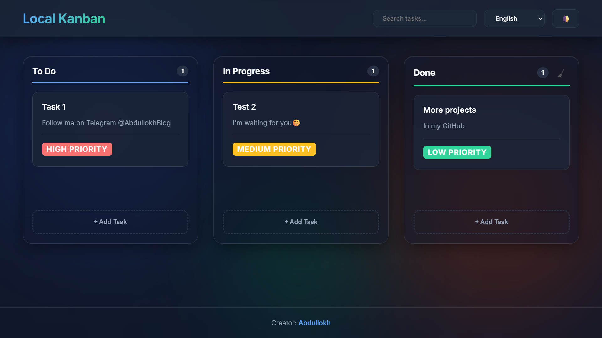

<div align="center">

# 🌟 Ultra-Modern Local Kanban

[](https://en.wikipedia.org/wiki/HTML5)
[](https://en.wikipedia.org/wiki/CSS3)
[](https://developer.mozilla.org/en-US/docs/Web/JavaScript)
[](https://github.com/)

A hyper-optimized, visually stunning Kanban board running entirely within your browser. 
No backend. No database. Pure speed and privacy.


</div>

---

## 🇺🇸 English
"Local Kanban" is a high-performance productivity tool. No internet required. Data is stored safely in your browser via `localStorage`. Built with premium "Glassmorphism" design paradigms.

## 🇷🇺 Русский
"Local Kanban" — это высокопроизводительный инструмент для продуктивности. Интернет не требуется. Данные надежно хранятся в вашем браузере через `localStorage`. Создан с использованием премиального дизайна «Глассморфизм».

## 🇺🇿 O'zbekcha
"Local Kanban" — bu yuqori samaradorlikka ega mahsuldorlik vositasi. Internet talab qilinmaydi. Ma'lumotlar brauzeringizda xavfsiz saqlanadi (`localStorage` orqali). Premium "Glassmorphism" dizayni asosida yaratilgan.

---

## ✨ Core Features

* **🛡️ Local-First Architecture:** Zero backend, instantly responsive, and works completely offline. Your data never leaves your device.
* **🎨 Glassmorphism UI:** A sleek, premium design aesthetic combining dynamic translucent backgrounds, subtle blurs, and layered shadows.
* **🖐️ Hardware Accelerated Drag & Drop:** Robust column-switching and smooth reordering utilizing standard HTML5 APIs.
* **🌓 Advanced Theming Engine:** Automatically detects your OS system preference (`prefers-color-scheme`) on first launch. Smooth transitions between Light and Dark modes.
* **🌍 Internationalization (i18n):** Instantly switch between English, Russian, and Uzbek interfaces with real-time DOM hydration. No page reloads required.
* **⚡ Highly Performant:** No external libraries, React, or Vue overhead. Written in clean, vanilla ES6+ JavaScript.

---

## 🚀 Getting Started

Since this project has absolutely **zero dependencies**, running it is as simple as opening a file.

1. **Clone or Download** this repository to your machine.
2. Locate the `index.html` file.
3. **Double-click** `index.html` to open it in Chrome, Safari, Firefox, or Edge.
4. *Start managing your tasks!*

---

## 🏗️ Technical Architecture

The codebase is split into specific domains of responsibility to allow for an enterprise-level MVC (Model-View-Controller) structure, despite being entirely Vanilla JS.

```text
kanban-app/
├── index.html           # Semantic Structure & ARIA Labels
├── css/                 
│   ├── main.css         # Global Resets, Typography, Body Layout
│   ├── components.css   # Modals, Cards, Buttons, and Toast Notifications
│   └── themes.css       # Dynamic CSS Variables processing Light/Dark modes
├── js/                  
│   ├── core.js          # Core Engine: State immutability & Data mutations
│   ├── storage.js       # JSON Data Adapter: LocalStorage debouncing & I/O
│   ├── i18n.js          # Translation Dictionary mapping
│   └── ui.js            # View Controller: DOM Event Delegation & Hydration
└── data/                
    └── schema.json      # Reference for JSON Data Structure
```

---

## 👨‍💻 Developer & Attribution

Conceptualized and built by **[Abdullokh](https://abdullokh.bio.link/)**.
